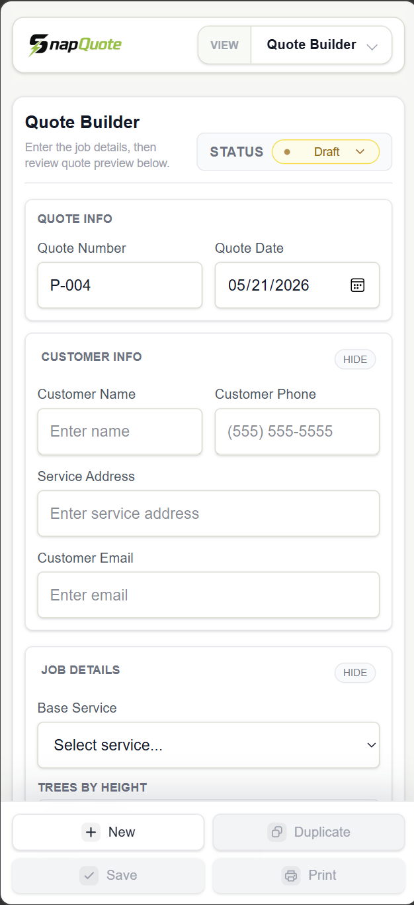
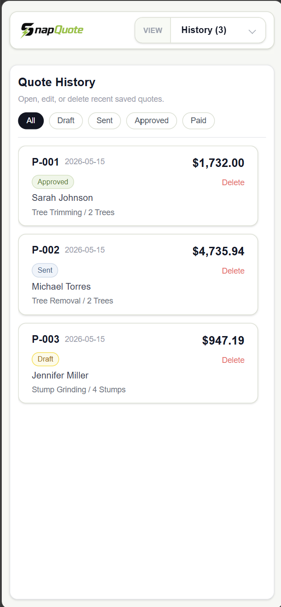
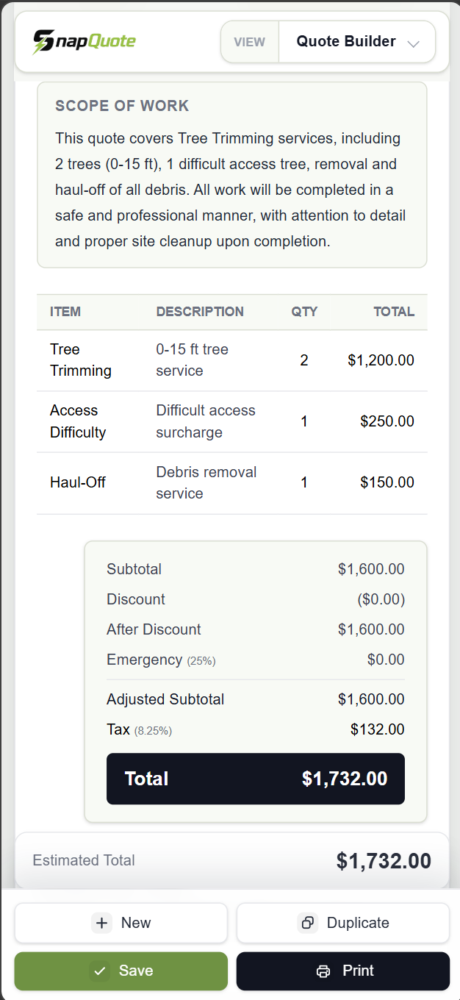
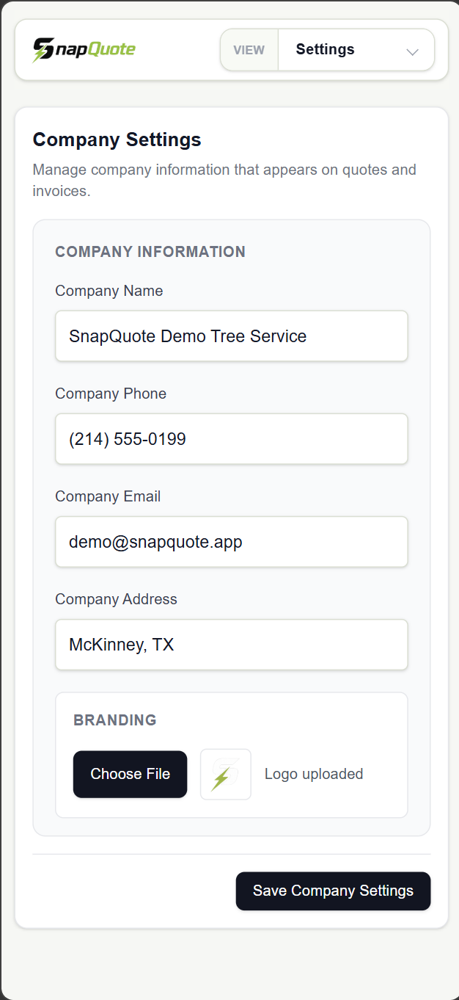
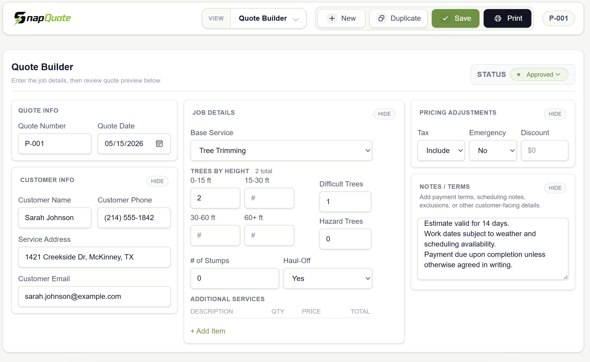

# SnapQuote

SnapQuote is a mobile-first tree service estimating and quote management tool built with Next.js, Tailwind CSS, and Supabase.

The app is designed for contractors who need to quickly build professional tree service quotes in the field, save customer/job details, manage quote history, track quote status, and export clean PDF-ready estimates.

## Features

- Mobile-first quote builder
- Tree service pricing logic
- Tree height tier pricing
- Difficult access and hazard tree modifiers
- Stump grinding and haul-off options
- Manual additional service line items
- Customer information capture
- Saved quote history
- Quote status tracking: Draft, Sent, Approved, Paid
- Status filtering in quote history
- Editable saved quotes
- Duplicate quote workflow
- Professional quote preview
- Print / Save PDF export
- Mobile portrait PDF optimization
- Custom company logo and company information support
- Supabase-backed quote storage

## Screenshots

### Mobile Quote Builder



---

### Mobile Quote History



---

### Mobile PDF Export



---

### Settings & Configuration



---

### Desktop Quote Preview




## Tech Stack

- Next.js
- React
- TypeScript
- Tailwind CSS
- Supabase
- Vercel

## Project Purpose

SnapQuote was built as a focused estimating tool for tree service businesses. The goal was to create a clean, field-friendly workflow that helps service providers generate professional quotes quickly without relying on spreadsheets, paper forms, or disconnected admin tools.

## Why I Built This

Many small service businesses still rely on paper estimates,
phone-based quoting, or disconnected spreadsheets.

SnapQuote was built to explore a faster, mobile-first quoting
workflow tailored specifically for field service businesses.

The project focused heavily on:
- field usability
- fast quote generation
- clean PDF exports
- mobile responsiveness
- operational simplicity

## Current Status

This project is an active working prototype / MVP. Core quote creation, saving, editing, history, status tracking, and PDF export workflows are functional.

## Future Improvements

Potential future enhancements include:

- Customer search and filtering
- Quote search
- Invoice generation
- Customer-facing quote approval links
- Email quote delivery
- Photo attachments
- Offline draft autosave
- Expanded reporting and dashboard features

## Local Development

Install dependencies:

```bash
npm install